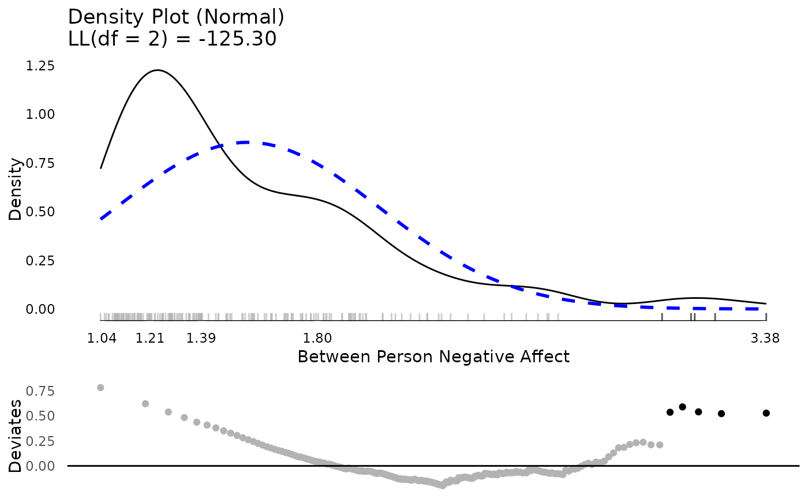
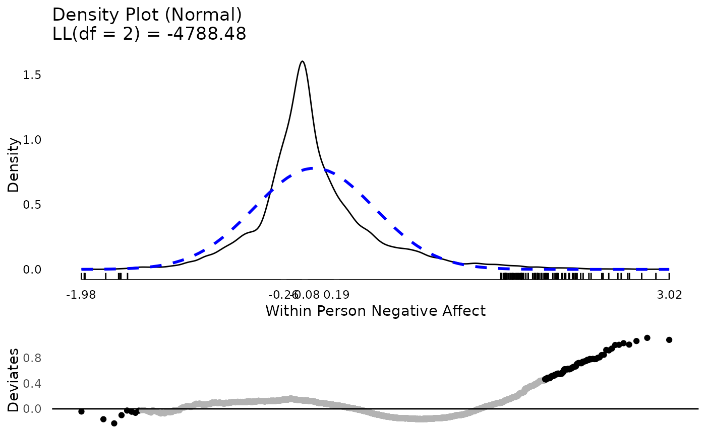
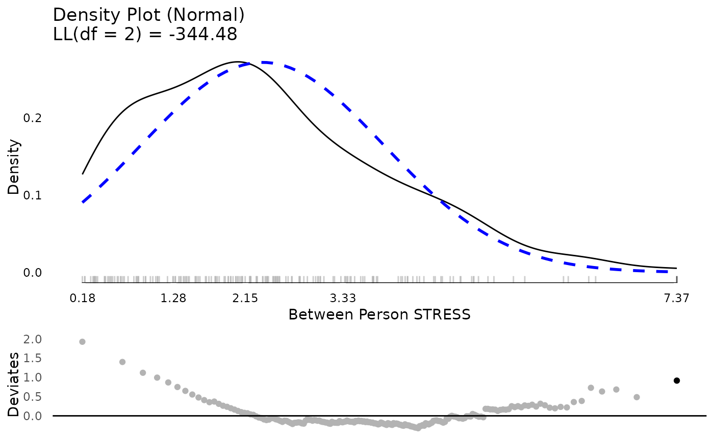
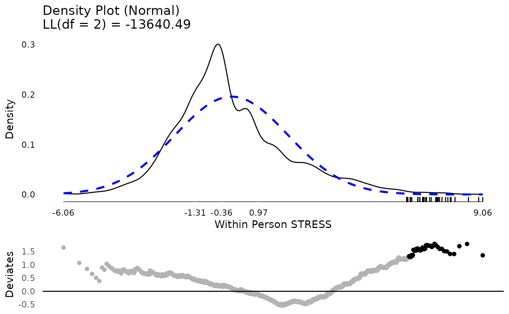
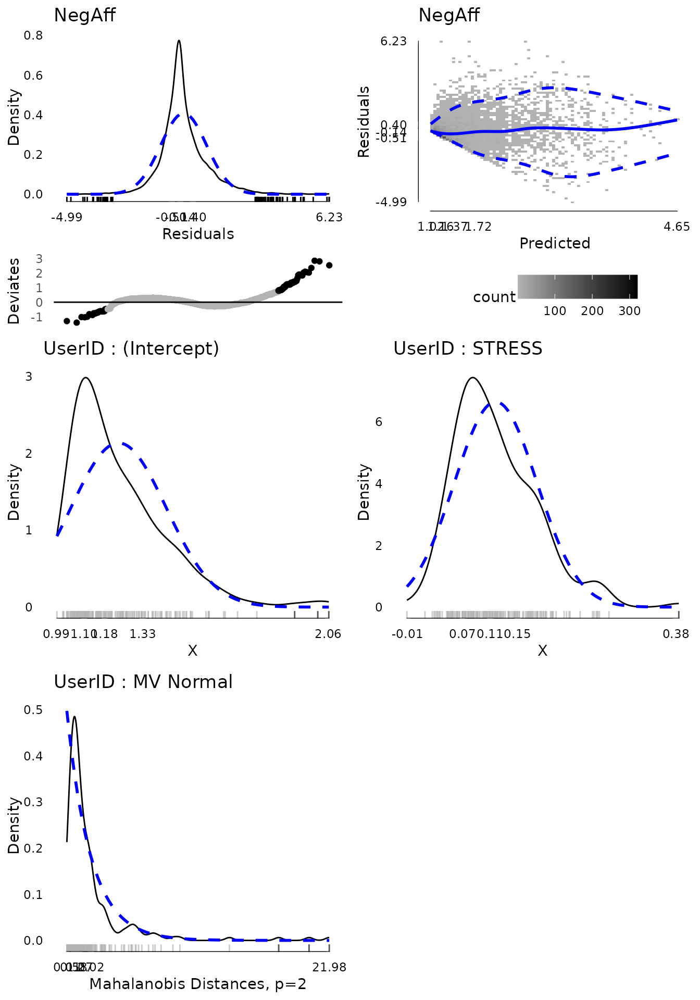
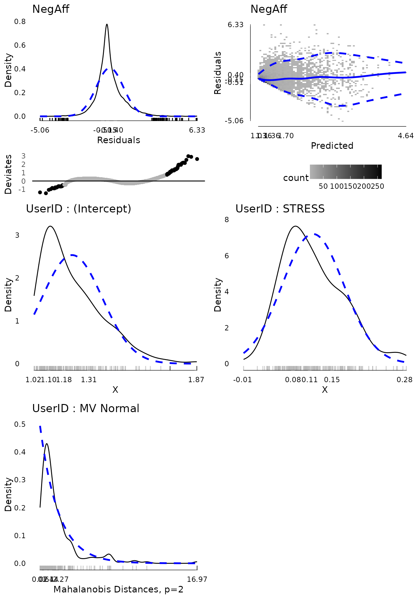
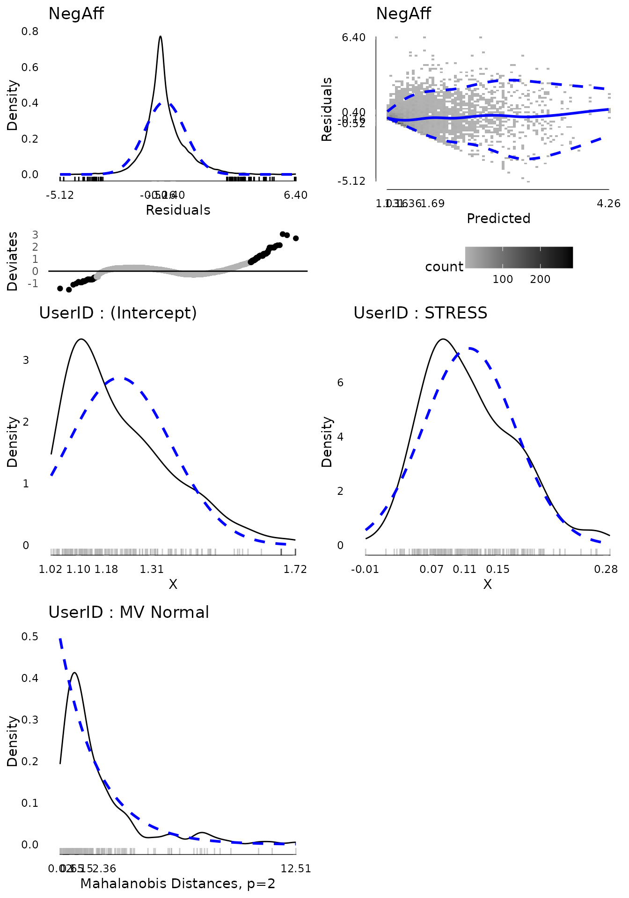

# Multilevel Models using lmer

This vignette shows how to use the `multilevelTools` package for further
diagnostics and testing of mixed effects (a.k.a., multilevel) models
using [`lmer()`](https://rdrr.io/pkg/lme4/man/lmer.html) from the `lme4`
package.

To get started, load the `lme4` package, which actually fits the models,
and the `multilevelTools` package. Although not required, we load the
`lmerTest` package to get approximate degrees of freedom for use in
calculating p-values for the fixed effects. Without `lmerTest` p-values
are based on asymptotic normality. We will also load an example dataset
from the `JWileymisc` package, `aces_daily`, using the
[`data()`](https://rdrr.io/r/utils/data.html) function. The `aces_daily`
dataset is simulated data from a daily, ecological momentary assessment
study of 191 participants who completed ratings of **a**ctivity,
**c**oping, **e**motions, and **s**tress (aces) up to three times per
day for twelve days. Only a subset of variables were simulated, but it
is a nice example of messy, real-world type data for mixed effects or
multilevel models.

``` r

## load lme4, JWileymisc, and multilevelTools packages
## (i.e., "open the 'apps' ") 
library(lme4)
#> Loading required package: Matrix
library(lmerTest)
#> 
#> Attaching package: 'lmerTest'
#> The following object is masked from 'package:lme4':
#> 
#>     lmer
#> The following object is masked from 'package:stats':
#> 
#>     step
library(extraoperators)
library(JWileymisc)
library(multilevelTools)
library(data.table)

## load some sample data for examples
data(aces_daily, package = "JWileymisc")
```

### A Quick View of the Data

Let’s start with a quick view of the **str**ucture of the data.

``` r

## overall structure
str(aces_daily, nchar.max = 30)
#> 'data.frame':    6599 obs. of  19 variables:
#>  $ UserID            : int  1 1 1 1 1 1 1 1 1 1 ...
#>  $ SurveyDay         : Date, format: "2017-02-24" "2017-02-24" ...
#>  $ SurveyInteger     : int  2 3 1 2 3 1 2 3 1 2 ...
#>  $ SurveyStartTimec11: num  1.93e-01 4.86e-| __truncated__ ...
#>  $ Female            : int  0 0 0 0 0 0 0 0 0 0 ...
#>  $ Age               : num  21 21 21 21 21 21 21 21 21 21 ...
#>  $ BornAUS           : int  0 0 0 0 0 0 0 0 0 0 ...
#>  $ SES_1             : num  5 5 5 5 5 5 5 5 5 5 ...
#>  $ EDU               : int  0 0 0 0 0 0 0 0 0 0 ...
#>  $ SOLs              : num  NA 0 NA NA 6.92 ...
#>  $ WASONs            : num  NA 0 NA NA 0 NA NA 1 NA NA ...
#>  $ STRESS            : num  5 1 1 2 0 0 3 1 0 3 ...
#>  $ SUPPORT           : num  NA 7.02 NA NA 6.15 ...
#>  $ PosAff            : num  1.52 1.51 1.56 1.56 1.13 ...
#>  $ NegAff            : num  1.67 1 NA 1.36 1 ...
#>  $ COPEPrb           : num  NA 2.26 NA NA NA ...
#>  $ COPEPrc           : num  NA 2.38 NA NA NA ...
#>  $ COPEExp           : num  NA 2.41 NA NA 2.03 ...
#>  $ COPEDis           : num  NA 2.18 NA NA NA ...
```

For this example, we will just work with negative affect, `NegAff`, as
the outcome variable and stress, `STRESS`, as our predictor. Because
observations are repeated per person, we also need to use a variable
that indicates which observations belong to which person, `UserID`. The
code that follows shows how many unique people and observations we have
for each variable.

``` r

## how many unique IDs (people) are there?
length(unique(aces_daily$UserID))
#> [1] 191

## how many not missing observations of negative affect are there?
sum(!is.na(aces_daily$NegAff))
#> [1] 6389

## how many not missing observations of stress are there?
sum(!is.na(aces_daily$STRESS))
#> [1] 6402
```

Finally, we might explore each variable briefly, before jumping into
analyzing them and examining diagnostics and effects of our models.
Using the [`summary()`](https://rdrr.io/r/base/summary.html) function on
each variable gives us some basic descriptive statistics in the form of
a five number summary (minimum, first quartile, median (second
quartile), third quartile, and maximum) as well as the arithmetic mean.
The NA’s tell us how many observations are missing negative affect. We
can see that both variables are quite skewed as their minimum, first
quartile and medians are all close together and far away from the
maximum.

``` r

summary(aces_daily$NegAff)
#>    Min. 1st Qu.  Median    Mean 3rd Qu.    Max.    NA's 
#>   1.000   1.029   1.280   1.550   1.813   5.000     210

summary(aces_daily$STRESS)
#>    Min. 1st Qu.  Median    Mean 3rd Qu.    Max.    NA's 
#>   0.000   0.000   1.000   2.328   4.000  10.000     197
```

Because these are repeated measures data, another useful descriptive
statistic is the intraclass correlation coefficient or ICC. The ICC is a
measure of the proportion of variance that is between people versus the
total variance (i.e., variance between people and variance within
persons). `multilevelTools` provides a function,
[`iccMixed()`](https://joshuawiley.com/multilevelTools/reference/iccMixed.md)
to estimate ICCs based off of mixed effects / multilevel models. The
following code does this for negative affect and stress, first naming
all the arguments and then using shorter unnamed approach, that is
identical results, but easier to type. The relevant output is the ICC
for the row named `UserID`. An ICC of 1 indicates that 100% of all
variance exists between people, which would mean that 0% of variance
exists within person, indicating that people have identical scores every
time they are assessed. Conversely an ICC of 0 would indicate that
everyone’s average was identical and 100% of the variance exists within
person. For negative affect and stress, we can see the ICCs fall between
0 and 1, indicating that some variance is between people (i.e.,
individuals have different average levels of negative affect and stress)
but also that some variance is within person, meaning that people’s
negative affect and stress fluctuate or vary within a person across the
day and the 12-days of the study.

``` r

iccMixed(
  dv = "NegAff",
  id = "UserID",
  data = aces_daily)
#>         Var     Sigma       ICC
#>      <char>     <num>     <num>
#> 1:   UserID 0.2100950 0.4374139
#> 2: Residual 0.2702166 0.5625861

iccMixed("STRESS", "UserID", aces_daily)
#>         Var   Sigma       ICC
#>      <char>   <num>     <num>
#> 1:   UserID 2.04045 0.3228825
#> 2: Residual 4.27903 0.6771175
```

Finally, we might want to examine the distribution of the variables
visually. Visual exploration is a great way to identify the distribution
of variables, extreme values, and other potential issues that can be
difficult to identify numerically, such as bimodal distributions. For
multilevel data, it is helpful to examine between and within person
aspects of a variable separately. `multilevelTools` makes this easy
using the
[`meanDecompose()`](https://joshuawiley.com/multilevelTools/reference/meanDecompose.md)
function. This is important as, for example, if on 11 of 12 days,
someone has a negative affect score of 5, and then one day a score of 1,
the score of 1 may be an extreme value, for that person even though it
is common for the rest of the participants in the study.
[`meanDecompose()`](https://joshuawiley.com/multilevelTools/reference/meanDecompose.md)
returns a list with `X` values at different levels, here by ID and the
residuals, which in this case are within person effects.

We make plots of the distributions using
[`testDistribution()`](https://joshuawiley.com/JWileymisc/reference/testDistribution.html),
which defaults to testing against a normal distribution, which is a
common default and in our case appropriate for linear mixed effects /
multilevel models. The graphs show a density plot in black lines, a
normal distribution in dashed blue lines, a rug plot showing where
individual observations fall, and the x-axis is a five number summary
(minimum, first quartile, median, third quartile, maximum). The bottom
plot is a Quantile-Quantile plot rotated to be horizontal instead of
diagonal. Black dots / lines indicate extreme values, based on the
expected theoretical distribution, here normal (gaussian), and specified
percentile, `.001`. For more details, see
[`help("testDistribution")`](https://joshuawiley.com/JWileymisc/reference/testDistribution.html).

The between person results for negative affect show about five people
with relative extreme higher scores. Considering negative affect ranges
from 1 to 5, they are not impossible scores, but they are extreme
relative to the rest of this particular sample. At the within person
level, there are thousands of observations and there are many extreme
scores. Based on these results, we may suspect that when we get into our
mixed effects / multilevel model, there will be more extreme residual
scores to be dealt with (which roughly correspond to within person
results) than extreme random effects (which roughly correspond to
between person results).

``` r

tmp <- meanDecompose(NegAff ~ UserID, data = aces_daily)
str(tmp, nchar.max = 30)
#> List of 2
#>  $ NegAff by UserID  :Classes 'data.table' and 'data.frame': 191 obs. of  2 variables:
#>   ..$ UserID: int [1:191] 1 2 3 4 5 6 7 8 9 10 ...
#>   ..$ X     : num [1:191] 1.75 1.12 1.68 1.79 1.1 ...
#>   ..- attr(*, ".internal.selfref")=<externalptr> 
#>  $ NegAff by residual:Classes 'data.table' and 'data.frame': 6599 obs. of  1 variable:
#>   ..$ X: num [1:6599] -0.0787 -0.7478| __truncated__ ...
#>   ..- attr(*, ".internal.selfref")=<externalptr>

plot(testDistribution(tmp[["NegAff by UserID"]]$X,
                      extremevalues = "theoretical", ev.perc = .001),
     varlab = "Between Person Negative Affect")
```



``` r

plot(testDistribution(tmp[["NegAff by residual"]]$X,
                      extremevalues = "theoretical", ev.perc = .001),
     varlab = "Within Person Negative Affect")
```



The same exercise for stress shows a better between and within person
distribution. Certainly there is some skew and its not a perfect normal
distribution. However, neither of these are required for predictors in
mixed effects models. The extreme values are not that extreme or that
far away from the rest of the sample, so we might feel comfortable
proceeding with the data as is.

``` r

tmp <- meanDecompose(STRESS ~ UserID, data = aces_daily)

plot(testDistribution(tmp[["STRESS by UserID"]]$X,
                      extremevalues = "theoretical", ev.perc = .001),
     varlab = "Between Person STRESS")
```



``` r

plot(testDistribution(tmp[["STRESS by residual"]]$X,
                      extremevalues = "theoretical", ev.perc = .001),
     varlab = "Within Person STRESS")
```



## Mixed Effects (Multilevel) Model

With a rough sense of our variables, we proceed to fitting a mixed
effects model using the
[`lmer()`](https://rdrr.io/pkg/lme4/man/lmer.html) function from `lme4`.
Here we use negative affect as the outcome predicted by stress. Both the
intercept and linear slope of stress on negative affect are included as
fixed and random effects. The random effects are allowed to be
correlated, so that, for example, people who have higher negative affect
under low stress may also have a flatter slope as thye may have less
room to increase in negative affect at higher stress levels.

At the time of writing, this model using the default optimizer and
control criteria fails to converge (albeit the gradient is very close).
These convergence warnings can be spurious but also may suggest either a
too complex model or need to refine some other aspect of the model, such
as scaling predictors or changing the optimizer or arguments to the
optimizer.

``` r

m <- lmer(NegAff ~ STRESS + (1 + STRESS | UserID),
          data = aces_daily)
#> Warning in checkConv(attr(opt, "derivs"), opt$par, ctrl = control$checkConv, :
#> Model failed to converge with max|grad| = 0.00201381 (tol = 0.002, component 1)
```

Here we use the
[`lmerControl()`](https://rdrr.io/pkg/lme4/man/lmerControl.html)
function to specify a different optimization algorithm using the
Nelder-Mead Method
(<https://en.wikipedia.org/wiki/Nelder%E2%80%93Mead_method>). We also
tighten the tolerance values. This is then passed to
[`lmer()`](https://rdrr.io/pkg/lme4/man/lmer.html) by setting the
argument, `control = strictControl`. This converges without warning.

``` r

strictControl <- lmerControl(optCtrl = list(
   algorithm = "NLOPT_LN_NELDERMEAD",
   xtol_abs = 1e-12,
   ftol_abs = 1e-12))

m <- lmer(NegAff ~ STRESS + (1 + STRESS | UserID),
          data = aces_daily, control = strictControl)
```

Now we move on to examine model diagnostics. For linear mixed effects /
multilevel models, the residuals should follow a normal distribution,
the random effects should follow a multivariate normal distribution, and
the residual variance should be homogenous (the same) as a single
residual variance is estimated and used for the whole model. The
[`modelDiagnostics()`](https://joshuawiley.com/JWileymisc/reference/modelDiagnostics.html)
function in `multilevelTools` helps to evaluate these assumptions
graphically.

The first plot shows (top left) the distribution of residuals. It is
somewhat too narrow for a normal distribution (i.e., leptokurtic) and
consequently many of the residuals on both tails are considered extreme
values. However, the distribution is fairly symmetrical and for the
residuals we have over 6,000 observations which will tend to make
results relatively robust to violations.

The second plot (top right) shows the fitted (predicted) values for each
observation against the residuals. The colour of the blocks indicates
how many observations fall at a particular point. The solid blue line is
a loess smooth line. Hopefully this line is about flat and stays
consistently at residuals of 0 regardless of the predicted value,
indicating no systematic bias. Finally the dashed blue lines indicate
the 10th and 90th percentile (estimated from a quantile regression
model) of the residuals across predicted values. If the residual
variance is homogenous across the spread of predicted values, we would
expect these dashed lines to be flat and parallel to each other. That is
approximately true for all predicted values above about 1.7. For low
predicted values, the residuals are 0 or higher and the spread of the
dashed lines is narrowed. This is because people cannot have negative
affect scores below 1 and many people reported negative affect around 1.
Therefore for predicted negative affect scores of 1, the residuals tend
to be about 0. This pattern is not ideal, but also not indicative of a
terrible violation of the assumption. Two possible approaches to
relaxing the assumption given data like these would be to use a censored
model, that assumes true negative affect scores may be lower but are
censored at 1 due to limitations in the measurement. Another would be to
use a location and scale mixed effects model that models not only the
mean (location) but also the scale (variance) as a function of some
variables, which would allow the residual variance to differ. These are
beyond the scope of this document, however.

The last three plots show the univariate distribution of the intercept
and stress slope by `UserID`, the random intercept and slope and a test
of whether the random intercept and slope are multivariate normal The
multivariate normality test, based on the mahalonbis distances, suggests
that there are a few, relatively extreme people. We might consider
dropping these individuals from the analysis to examine whether results
are sensitive to these extreme cases.

``` r

md <- modelDiagnostics(m, ev.perc = .001)

plot(md, ask = FALSE, ncol = 2, nrow = 3)
```



In order to drop people who were extreme on the multivariate normality
test, we can access a data table of the extreme values from the
`modelDiagnostics` object. We subset it to only include the multivariate
effects and use the [`head()`](https://rdrr.io/r/utils/head.html)
function to show the first few rows. The extreme value table shows the
scores on the outcome, the `UserID`, the index (which row) in the
dataset, and the effect type, here all multivariate since we subset for
that. We can use the [`unique()`](https://rdrr.io/r/base/unique.html)
function to identify the IDs, which shows it is three IDs.

``` r

mvextreme <- subset(md$extremeValues,
  EffectType == "Multivariate Random Effect UserID")

head(mvextreme)
#>      NegAff UserID Index                        EffectType
#>       <num>  <int> <int>                            <char>
#> 1: 3.861232     56  1929 Multivariate Random Effect UserID
#> 2: 2.362821     56  1930 Multivariate Random Effect UserID
#> 3: 3.145248     56  1931 Multivariate Random Effect UserID
#> 4: 2.574245     56  1932 Multivariate Random Effect UserID
#> 5: 1.955497     56  1933 Multivariate Random Effect UserID
#> 6: 1.848545     56  1934 Multivariate Random Effect UserID

unique(mvextreme$UserID)
#> [1]  56 111 185
```

We can update the existing model using the
[`update()`](https://rdrr.io/r/stats/update.html) function and in the
data, just subset to exclude those three extreme IDs. We re-run the
diagnostics and plot again revealing one new multivariate extreme value.

``` r

m2 <- update(m, data = subset(aces_daily,
  UserID %!in% unique(mvextreme$UserID)))

md2 <- modelDiagnostics(m2, ev.perc = .001)

plot(md2, ask = FALSE, ncol = 2, nrow = 3)
```



``` r

mvextreme2 <- subset(md2$extremeValues,
  EffectType == "Multivariate Random Effect UserID")

unique(mvextreme2$UserID)
#> [1] 123
```

Again removing this further extreme ID and plotting diagnostics suggests
that now the random effects are fairly “clean”.

``` r

m3 <- update(m, data = subset(aces_daily,
  UserID %!in% c(unique(mvextreme$UserID), unique(mvextreme2$UserID))))

md3 <- modelDiagnostics(m3, ev.perc = .001)

plot(md3, ask = FALSE, ncol = 2, nrow = 3)
```



Now that we have a model whose diagnostics we are reasonably happy with,
we can examine the results. The
[`modelPerformance()`](https://joshuawiley.com/JWileymisc/reference/modelPerformance.html)
function from the `multilevelTools` package gives some fit indices for
the overall model, including measures of the variance accounted for by
the fixed effects (marginal R2) and from the fixed and random effects
combined (conditional R2). We also get information criterion (AIC, BIC),
although note that with a REML estimator, the log likelihood and thus
information criterion are not comparable to if the ML estimator was
used.

``` r

modelPerformance(m3)
#> $Performance
#>     Model Estimator N_Obs     N_Groups      AIC      BIC        LL  LLDF
#>    <char>    <char> <num>       <char>    <num>    <num>     <num> <num>
#> 1: merMod      REML  6262 UserID (187) 7173.374 7213.827 -3580.687     6
#>        Sigma MarginalR2 ConditionalR2 MarginalF2 ConditionalF2
#>        <num>      <num>         <num>      <num>         <num>
#> 1: 0.4070053  0.2428357     0.5173029  0.3207174      1.071693
#> 
#> attr(,"class")
#> [1] "modelPerformance.merMod" "modelPerformance"
```

To see the results of individual variables, we can use the
[`summary()`](https://rdrr.io/r/base/summary.html) function to get the
default model summary. Note that this summary differs slightly from that
produced by `lme4` as it is overridden by `lmerTest` which adds degrees
of freedom and p-values.

``` r

summary(m3)
#> Linear mixed model fit by REML. t-tests use Satterthwaite's method [
#> lmerModLmerTest]
#> Formula: NegAff ~ STRESS + (1 + STRESS | UserID)
#>    Data: 
#> subset(aces_daily, UserID %!in% c(unique(mvextreme$UserID), unique(mvextreme2$UserID)))
#> Control: strictControl
#> 
#> REML criterion at convergence: 7161.4
#> 
#> Scaled residuals: 
#>     Min      1Q  Median      3Q     Max 
#> -5.1249 -0.5156 -0.1579  0.4040  6.4032 
#> 
#> Random effects:
#>  Groups   Name        Variance Std.Dev. Corr
#>  UserID   (Intercept) 0.027950 0.16718      
#>           STRESS      0.003925 0.06265  0.43
#>  Residual             0.165653 0.40701      
#> Number of obs: 6262, groups:  UserID, 187
#> 
#> Fixed effects:
#>              Estimate Std. Error        df t value Pr(>|t|)    
#> (Intercept) 1.217e+00  1.456e-02 1.622e+02   83.64   <2e-16 ***
#> STRESS      1.152e-01  5.473e-03 1.854e+02   21.05   <2e-16 ***
#> ---
#> Signif. codes:  0 '***' 0.001 '**' 0.01 '*' 0.05 '.' 0.1 ' ' 1
#> 
#> Correlation of Fixed Effects:
#>        (Intr)
#> STRESS 0.103
```

This default summary gives quite a bit of key information. However, it
does not provide some of the results that often are desired for
scientific publication. Confidence intervals are commonly reported and t
values often are not reported in preference for p-values. In addition,
it is increasingly common to ask for effect sizes. The
[`modelTest()`](https://joshuawiley.com/JWileymisc/reference/modelTest.html)
function in `multilevelTools` provides further tests, including tests of
the combined fixed + random effect for each variable and effect sizes
based off the independent change in marginal and conditional R2, used to
calculate a sort of cohen’s F2. All of the results are available in a
series of tables for any programattic use. However, for individual use
or reporting, caling
[`APAStyler()`](https://joshuawiley.com/JWileymisc/reference/APAStyler.html)
will produce a nicely formatted output for humans. Confidence intervals
are added in brackets and the effect sizes at the bottom are listed for
stress considering fixed + random effects together.

``` r

mt3 <- modelTest(m3)
#> Parameters and CIs are based on REML, 
#> but modelTests requires ML not REML fit for comparisons, 
#> and these are used in effect sizes. Refitting.

names(mt3) ## list of all tables available
#> [1] "FixedEffects"  "RandomEffects" "EffectSizes"   "OverallModel"

APAStyler(mt3)
#>                              Term                  Est           Type
#>                            <char>               <char>         <char>
#>  1:                   (Intercept) 1.22*** [1.19, 1.25]  Fixed Effects
#>  2:                        STRESS 0.12*** [0.10, 0.13]  Fixed Effects
#>  3: cor_STRESS.(Intercept)|UserID                 0.43 Random Effects
#>  4:         sd_(Intercept)|UserID                 0.17 Random Effects
#>  5:              sd_STRESS|UserID                 0.06 Random Effects
#>  6:                         sigma                 0.41 Random Effects
#>  7:                      Model DF                    6  Overall Model
#>  8:                    N (Groups)         UserID (187)  Overall Model
#>  9:              N (Observations)                 6262  Overall Model
#> 10:                        logLik             -3573.08  Overall Model
#> 11:                           AIC              7158.16  Overall Model
#> 12:                           BIC              7198.61  Overall Model
#> 13:                   Marginal R2                 0.24  Overall Model
#> 14:                   Marginal F2                 0.32  Overall Model
#> 15:                Conditional R2                 0.52  Overall Model
#> 16:                Conditional F2                 1.07  Overall Model
#> 17:       STRESS (Fixed + Random)  0.32/0.24, p < .001   Effect Sizes
#> 18:               STRESS (Random) -0.07/0.01, p < .001   Effect Sizes
```

The output of
[`APAStyler()`](https://joshuawiley.com/JWileymisc/reference/APAStyler.html)
can easily be copied and pasted into Excel or Word for formatting and
publication. If the format is not as desired, some changes are fairly
easy to make automatically. For example the following code uses 3
decimal points, lists exact p-values, and uses a semi colon instead of a
comma for confidence intervals.

``` r

APAStyler(mt3,
          format = list(
            FixedEffects = "%s, %s (%s; %s)",
            RandomEffects = c("%s", "%s (%s, %s)"),
            EffectSizes = "%s, %s; %s"),
          digits = 3,
          pcontrol = list(digits = 3, stars = FALSE,
                          includeP = TRUE, includeSign = TRUE,
                          dropLeadingZero = TRUE))
#>                              Term                            Est           Type
#>                            <char>                         <char>         <char>
#>  1:                   (Intercept) 1.217, p < .001 (1.189; 1.246)  Fixed Effects
#>  2:                        STRESS 0.115, p < .001 (0.104; 0.126)  Fixed Effects
#>  3: cor_STRESS.(Intercept)|UserID                          0.427 Random Effects
#>  4:         sd_(Intercept)|UserID                          0.167 Random Effects
#>  5:              sd_STRESS|UserID                          0.063 Random Effects
#>  6:                         sigma                          0.407 Random Effects
#>  7:                      Model DF                              6  Overall Model
#>  8:                    N (Groups)                   UserID (187)  Overall Model
#>  9:              N (Observations)                           6262  Overall Model
#> 10:                        logLik                      -3573.079  Overall Model
#> 11:                           AIC                       7158.158  Overall Model
#> 12:                           BIC                       7198.611  Overall Model
#> 13:                   Marginal R2                          0.243  Overall Model
#> 14:                   Marginal F2                          0.322  Overall Model
#> 15:                Conditional R2                          0.517  Overall Model
#> 16:                Conditional F2                          1.068  Overall Model
#> 17:       STRESS (Fixed + Random)         0.322, 0.242; p < .001   Effect Sizes
#> 18:               STRESS (Random)        -0.069, 0.005; p < .001   Effect Sizes
```

Finally,
[`APAStyler()`](https://joshuawiley.com/JWileymisc/reference/APAStyler.html)
can be used with multiple models to create a convenient comparison. For
example, although we removed several extreme values, we might want to
compare the results in the full data to the dataset with extreme values
removed to evaluate whether critical coefficients or effect sizes
changed and if so how much. Some quantities, like the log likelihood,
AIC and BIC are not comparable as the sample size changed. However,
effect size estimates like the model marginal and conditional R2 can be
reasonably compared as can the fixed effect coefficients and the effect
sizes for particular predictors.

To create the output, we pass a list of `modelTest` objects and we can
add names so that they are more nicely named in the output. The results
show that the intercept, the predicted negative affect when stress is
zero is very slightly higher in the original than in the model with
outliers removed. The fixed effect coefficient for stress is identical,
but the confidence interval is very slightly wider after removing
outliers. Variability in the random intercept, slope, and residual
variance, sigma, are all slightly reduced. All in all, we could conclude
that the overall pattern of results and any conclusions that might be
drawn from them would not functionally change in the model with all
cases included versus after removing the extreme values, in this case.
This effectively serves as a “sensitivity analysis” evaluating how
sensitive the results of the model are to the inclusion / exclusion of
extreme values. In this case, not very sensitive, which may be
encouraging. In cases where there are large differences in the results,
careful thought may be needed around which model is more likely to be
“true” and what the implications of the differences are for
interpretting and utilizing the results.

``` r
## run modelTest() on the original model, m
mt <- modelTest(m)
#> Parameters and CIs are based on REML, 
#> but modelTests requires ML not REML fit for comparisons, 
#> and these are used in effect sizes. Refitting.

APAStyler(list(Original = mt, `Outliers Removed` = mt3))
#>                              Term             Original     Outliers Removed
#>                            <char>               <char>               <char>
#>  1:                   (Intercept) 1.24*** [1.20, 1.27] 1.22*** [1.19, 1.25]
#>  2:                        STRESS 0.12*** [0.11, 0.13] 0.12*** [0.10, 0.13]
#>  3: cor_STRESS.(Intercept)|UserID                 0.47                 0.43
#>  4:         sd_(Intercept)|UserID                 0.21                 0.17
#>  5:              sd_STRESS|UserID                 0.07                 0.06
#>  6:                         sigma                 0.42                 0.41
#>  7:                      Model DF                    6                    6
#>  8:                    N (Groups)         UserID (191)         UserID (187)
#>  9:              N (Observations)                 6389                 6262
#> 10:                        logLik             -3845.41             -3573.08
#> 11:                           AIC              7702.81              7158.16
#> 12:                           BIC              7743.39              7198.61
#> 13:                   Marginal R2                 0.23                 0.24
#> 14:                   Marginal F2                 0.29                 0.32
#> 15:                Conditional R2                 0.55                 0.52
#> 16:                Conditional F2                 1.23                 1.07
#> 17:       STRESS (Fixed + Random)  0.29/0.26, p < .001  0.32/0.24, p < .001
#> 18:               STRESS (Random) -0.06/0.02, p < .001 -0.07/0.01, p < .001
#>               Type
#>             <char>
#>  1:  Fixed Effects
#>  2:  Fixed Effects
#>  3: Random Effects
#>  4: Random Effects
#>  5: Random Effects
#>  6: Random Effects
#>  7:  Overall Model
#>  8:  Overall Model
#>  9:  Overall Model
#> 10:  Overall Model
#> 11:  Overall Model
#> 12:  Overall Model
#> 13:  Overall Model
#> 14:  Overall Model
#> 15:  Overall Model
#> 16:  Overall Model
#> 17:   Effect Sizes
#> 18:   Effect Sizes
```

## Interactions

Interactions in models are generally supported by `multilevelTools`.
However, some functions, specifically
[`modelTest()`](https://joshuawiley.com/JWileymisc/reference/modelTest.html)
do not work equally well with all types of interactions.
[`modelTest()`](https://joshuawiley.com/JWileymisc/reference/modelTest.html)
has good support for interactions with only continuous variables. It has
somewhat worse support for interactions involving one or more
categorical variables.

### Interactions with Categorical Variable(s)

First let’s take a look at an example with all categorical variables. We
will start with a model that does not have any interactions.

``` r
d <- as.data.table(aces_daily)[!is.na(SES_1) & !is.na(BornAUS)]
d[, SEScat := factor(SES_1)]
d[, BornAUScat := factor(BornAUS)]

m.noint <- lmer(PosAff ~ BornAUScat + SEScat + (1 | UserID), data = d)
```

Here are the fixed effeccts for the model with no interactions.

|             |          x |
|:------------|-----------:|
| (Intercept) |  2.6283333 |
| BornAUScat1 |  0.2111452 |
| SEScat5     | -0.1707281 |
| SEScat6     |  0.0307653 |
| SEScat7     |  0.0216888 |
| SEScat8     |  0.0874991 |

no interaction model fixed effects

Now, suppose that we decided to drop one of the predictors from the
model. We can update the model using the
[`update()`](https://rdrr.io/r/stats/update.html) function built into
`R`.

``` r
m.nointdrop <- update(m.noint, . ~ . - SEScat)
```

Here are the fixed effeccts for the model with no interactions after
dropping categorical subjective socioeconomic status (`SEScat`).

|             |         x |
|:------------|----------:|
| (Intercept) | 2.6086056 |
| BornAUScat1 | 0.2414211 |

no interaction model fixed effects after dropping a predictor

We can see that there are four less fixed effect coefficient. These two
models are called nested, because one model (the one dropping `SEScat`)
is fully nested or contained in the other model. This is essentially
what
[`modelTest()`](https://joshuawiley.com/JWileymisc/reference/modelTest.html)
does for us automatically and then it compares the two models. In the
table that follows, if you compare the Log Likelihood (LL) degrees of
freedom (DF), we can see that one model has 4 fewer degrees of freedom
than the other, reflecting a different number of parameters: the
coefficients for `SEScat` were dropped.

``` r
knitr::kable(
  t(modelCompare(m.nointdrop, m.noint)$Comparison),
  caption = "model comparison")
#> When using REML, the fixed effects structure must be identical,
#> but was different. Refitting with ML.
```

|               |              |              |               |
|:--------------|:-------------|:-------------|:--------------|
| Model         | Model 1      | Model 2      | Difference    |
| Estimator     | ML           | ML           |               |
| N_Obs         | 6210         | 6210         | 0             |
| N_Groups      | UserID (185) | UserID (185) |               |
| AIC           | 14311.531185 | 14317.515173 | 5.983988      |
| BIC           | 14338.46685  | 14371.38650  | 32.91965      |
| LL            | -7151.765593 | -7150.757587 | 1.008006      |
| LLDF          | 4            | 8            | 4             |
| Sigma         | 7.244037e-01 | 7.244031e-01 | -5.615116e-07 |
| MarginalR2    | 0.011454545  | 0.017427470  | 0.005972925   |
| ConditionalR2 | 5.475067e-01 | 5.475264e-01 | 1.972412e-05  |
| MarginalF2    | 0.011587272  | 0.017736574  | 0.006078864   |
| ConditionalF2 | 1.209977e+00 | 1.210074e+00 | 4.359177e-05  |
| Chi2          | NA           | NA           | 2.016012      |
| P             | NA           | NA           | 0.7328137     |

model comparison

These results match with those from
[`modelTest()`](https://joshuawiley.com/JWileymisc/reference/modelTest.html)
shown in the following table. Comparing the p-value for `SEScat` under
the effect sizes section with the model comparison.

``` r
knitr::kable(APAStyler(modelTest(m.noint)))
#> Parameters and CIs are based on REML, 
#> but modelTests requires ML not REML fit for comparisons, 
#> and these are used in effect sizes. Refitting.
```

| Term                    | Est                        | Type           |
|:------------------------|:---------------------------|:---------------|
| (Intercept)             | 2.63\*\*\* \[ 2.32, 2.94\] | Fixed Effects  |
| BornAUScat1             | 0.21 \[-0.04, 0.46\]       | Fixed Effects  |
| SEScat5                 | -0.17 \[-0.57, 0.23\]      | Fixed Effects  |
| SEScat6                 | 0.03 \[-0.37, 0.43\]       | Fixed Effects  |
| SEScat7                 | 0.02 \[-0.35, 0.39\]       | Fixed Effects  |
| SEScat8                 | 0.09 \[-0.36, 0.54\]       | Fixed Effects  |
| sd\_(Intercept)\|UserID | 0.80                       | Random Effects |
| sigma                   | 0.72                       | Random Effects |
| Model DF                | 8                          | Overall Model  |
| N (Groups)              | UserID (185)               | Overall Model  |
| N (Observations)        | 6210                       | Overall Model  |
| logLik                  | -7150.76                   | Overall Model  |
| AIC                     | 14317.52                   | Overall Model  |
| BIC                     | 14371.39                   | Overall Model  |
| Marginal R2             | 0.02                       | Overall Model  |
| Marginal F2             | 0.02                       | Overall Model  |
| Conditional R2          | 0.55                       | Overall Model  |
| Conditional F2          | 1.21                       | Overall Model  |
| BornAUScat (Fixed)      | 0.01/0.00, p = .098        | Effect Sizes   |
| SEScat (Fixed)          | 0.01/0.00, p = .733        | Effect Sizes   |

Now let’s look at what happens when there is an interaction.

``` r
m.int <- lmer(PosAff ~ BornAUScat * SEScat + (1 | UserID), data = d)
```

Here are the fixed effeccts for the model with an interaction involving
a categorical predictor.

|                     |          x |
|:--------------------|-----------:|
| (Intercept)         |  2.6206523 |
| BornAUScat1         |  0.2408151 |
| SEScat5             | -0.2502179 |
| SEScat6             |  0.0017685 |
| SEScat7             |  0.0643894 |
| SEScat8             |  0.3253807 |
| BornAUScat1:SEScat5 |  0.3284179 |
| BornAUScat1:SEScat6 |  0.0746243 |
| BornAUScat1:SEScat7 | -0.1382994 |
| BornAUScat1:SEScat8 | -0.3894738 |

interaction model fixed effects

Now, suppose that we decided to drop one of the predictors from the
model. We can update the model using the
[`update()`](https://rdrr.io/r/stats/update.html) function built into
`R`.

``` r
m.intdrop <- update(m.int, . ~ . - SEScat)
```

Here are the fixed effects for the model with an interaction after
dropping categorical subjective socioeconomic status (`SEScat`).

|                     |          x |
|:--------------------|-----------:|
| (Intercept)         |  2.6206523 |
| BornAUScat1         |  0.2408151 |
| BornAUScat0:SEScat5 | -0.2502179 |
| BornAUScat1:SEScat5 |  0.0781999 |
| BornAUScat0:SEScat6 |  0.0017685 |
| BornAUScat1:SEScat6 |  0.0763928 |
| BornAUScat0:SEScat7 |  0.0643894 |
| BornAUScat1:SEScat7 | -0.0739101 |
| BornAUScat0:SEScat8 |  0.3253807 |
| BornAUScat1:SEScat8 | -0.0640931 |

interaction model fixed effects after dropping a predictor

You can see immediately that we have the same number of fixed effects
coefficients. Before, we had the simple main effects of `SEScat` and
then how those differed when `BornAUScat = 1`. Now, we have the simple
main effects for both `BornAUScat = 0` and `BornAUScat = 1`. This
happens because of `R`’s formula interface and how it decides to dummy
code and create the underlying model matrix.

If we tried the following code to compare these two models, we would get
an error about the models not being nested.

``` r
modelCompare(m.intdrop, m.int)
```

The models are *not* nested within each other. In fact, they are the
same model, just parameterized differently. For example, this can be
seen by comparing the log likelihoods, which are the same.

``` r
logLik(m.int)
#> 'log Lik.' -7156.232 (df=12)
logLik(m.intdrop)
#> 'log Lik.' -7156.232 (df=12)
```

What we might have wanted is what would have happened if we constrained
the fixed effects for the `SEScat` dummy codes to 0. That, however, is
tricky to obtain.

[`modelTest()`](https://joshuawiley.com/JWileymisc/reference/modelTest.html)
tries to fail relatively gracefully. It will run, but not report a test
for the simple main effect overall of `SEScat`. It can, however, test
whether the two-way interaction adds beyond the main effects only.

``` r
knitr::kable(APAStyler(modelTest(m.int)))
#> Parameters and CIs are based on REML, 
#> but modelTests requires ML not REML fit for comparisons, 
#> and these are used in effect sizes. Refitting.
#> The full and reduced model had 12 and 12 parameters, respectively.
#> The reduced model should have fewer parameters.
#> This usually happens when there are interactions with categorical variables.
#> For an explanation, see:
#> https://joshuawiley.com/multilevelTools/articles/lmer-vignette.html
#> The full and reduced model had 12 and 12 parameters, respectively.
#> The reduced model should have fewer parameters.
#> This usually happens when there are interactions with categorical variables.
#> For an explanation, see:
#> https://joshuawiley.com/multilevelTools/articles/lmer-vignette.html
```

| Term                      | Est                        | Type           |
|:--------------------------|:---------------------------|:---------------|
| (Intercept)               | 2.62\*\*\* \[ 2.27, 2.98\] | Fixed Effects  |
| BornAUScat1               | 0.24 \[-0.46, 0.94\]       | Fixed Effects  |
| BornAUScat1:SEScat5       | 0.33 \[-0.60, 1.25\]       | Fixed Effects  |
| BornAUScat1:SEScat6       | 0.07 \[-0.81, 0.96\]       | Fixed Effects  |
| BornAUScat1:SEScat7       | -0.14 \[-0.96, 0.69\]      | Fixed Effects  |
| BornAUScat1:SEScat8       | -0.39 \[-1.35, 0.57\]      | Fixed Effects  |
| SEScat5                   | -0.25 \[-0.71, 0.21\]      | Fixed Effects  |
| SEScat6                   | 0.00 \[-0.48, 0.48\]       | Fixed Effects  |
| SEScat7                   | 0.06 \[-0.37, 0.50\]       | Fixed Effects  |
| SEScat8                   | 0.33 \[-0.31, 0.96\]       | Fixed Effects  |
| sd\_(Intercept)\|UserID   | 0.80                       | Random Effects |
| sigma                     | 0.72                       | Random Effects |
| Model DF                  | 12                         | Overall Model  |
| N (Groups)                | UserID (185)               | Overall Model  |
| N (Observations)          | 6210                       | Overall Model  |
| logLik                    | -7149.26                   | Overall Model  |
| AIC                       | 14322.53                   | Overall Model  |
| BIC                       | 14403.34                   | Overall Model  |
| Marginal R2               | 0.03                       | Overall Model  |
| Marginal F2               | 0.03                       | Overall Model  |
| Conditional R2            | 0.55                       | Overall Model  |
| Conditional F2            | 1.21                       | Overall Model  |
| BornAUScat (Fixed)        | NA/ NA, NA                 | Effect Sizes   |
| SEScat (Fixed)            | NA/ NA, NA                 | Effect Sizes   |
| BornAUScat:SEScat (Fixed) | 0.01/0.00, p = .560        | Effect Sizes   |

#### If you really want

What if you really want those tests for the simple main effects of a
categorical predictor? This can be done by manually dummy coding
predictors and creating the two, nested, models to compare.

``` r
## manually dummy code
d[, SEScat5 := fifelse(SES_1 == 5, 1, 0)]
d[, SEScat6 := fifelse(SES_1 == 6, 1, 0)]
d[, SEScat7 := fifelse(SES_1 == 7, 1, 0)]
d[, SEScat8 := fifelse(SES_1 == 8, 1, 0)]

## interaction model
m.intman <- lmer(PosAff ~ BornAUS * (SEScat5 + SEScat6 + SEScat7 + SEScat8) +
                   (1 | UserID), data = d)

## drop just the simple main effects of SEScat
m.intmandrop <- update(m.intman, . ~ . - SEScat5 - SEScat6 - SEScat7 - SEScat8)
```

Now we can compare the two models. As expected, they differ by 4 degrees
of freedom.

``` r
knitr::kable(
  t(modelCompare(m.intmandrop, m.intman)$Comparison),
  caption = "manual model comparison")
#> When using REML, the fixed effects structure must be identical,
#> but was different. Refitting with ML.
```

|               |              |              |               |
|:--------------|:-------------|:-------------|:--------------|
| Model         | Model 1      | Model 2      | Difference    |
| Estimator     | ML           | ML           |               |
| N_Obs         | 6210         | 6210         | 0             |
| N_Groups      | UserID (185) | UserID (185) |               |
| AIC           | 14319.07236  | 14322.52961  | 3.45726       |
| BIC           | 14372.94368  | 14403.33661  | 30.39292      |
| LL            | -7151.53618  | -7149.26481  | 2.27137       |
| LLDF          | 8            | 12           | 4             |
| Sigma         | 7.244035e-01 | 7.244022e-01 | -1.322381e-06 |
| MarginalR2    | 0.01283841   | 0.02618203   | 0.01334362    |
| ConditionalR2 | 5.475208e-01 | 5.475707e-01 | 4.986076e-05  |
| MarginalF2    | 0.01300538   | 0.02688596   | 0.01370238    |
| ConditionalF2 | 1.2100465035 | 1.2102900655 | 0.0001102067  |
| Chi2          | NA           | NA           | 4.54274       |
| P             | NA           | NA           | 0.3375096     |

manual model comparison

Incidentally, while you can still use
[`modelTest()`](https://joshuawiley.com/JWileymisc/reference/modelTest.html)
with this model,
[`modelTest()`](https://joshuawiley.com/JWileymisc/reference/modelTest.html)
no longer knows that SEScat5 to 8 belong to the same variable, so they
are tested individually, and you do not get the omnibus test.

``` r
knitr::kable(APAStyler(modelTest(m.intman)))
#> Parameters and CIs are based on REML, 
#> but modelTests requires ML not REML fit for comparisons, 
#> and these are used in effect sizes. Refitting.
```

| Term                    | Est                        | Type           |
|:------------------------|:---------------------------|:---------------|
| (Intercept)             | 2.62\*\*\* \[ 2.27, 2.98\] | Fixed Effects  |
| BornAUS                 | 0.24 \[-0.46, 0.94\]       | Fixed Effects  |
| BornAUS:SEScat5         | 0.33 \[-0.60, 1.25\]       | Fixed Effects  |
| BornAUS:SEScat6         | 0.07 \[-0.81, 0.96\]       | Fixed Effects  |
| BornAUS:SEScat7         | -0.14 \[-0.96, 0.69\]      | Fixed Effects  |
| BornAUS:SEScat8         | -0.39 \[-1.35, 0.57\]      | Fixed Effects  |
| SEScat5                 | -0.25 \[-0.71, 0.21\]      | Fixed Effects  |
| SEScat6                 | 0.00 \[-0.48, 0.48\]       | Fixed Effects  |
| SEScat7                 | 0.06 \[-0.37, 0.50\]       | Fixed Effects  |
| SEScat8                 | 0.33 \[-0.31, 0.96\]       | Fixed Effects  |
| sd\_(Intercept)\|UserID | 0.80                       | Random Effects |
| sigma                   | 0.72                       | Random Effects |
| Model DF                | 12                         | Overall Model  |
| N (Groups)              | UserID (185)               | Overall Model  |
| N (Observations)        | 6210                       | Overall Model  |
| logLik                  | -7149.26                   | Overall Model  |
| AIC                     | 14322.53                   | Overall Model  |
| BIC                     | 14403.34                   | Overall Model  |
| Marginal R2             | 0.03                       | Overall Model  |
| Marginal F2             | 0.03                       | Overall Model  |
| Conditional R2          | 0.55                       | Overall Model  |
| Conditional F2          | 1.21                       | Overall Model  |
| BornAUS (Fixed)         | 0.00/0.00, p = .487        | Effect Sizes   |
| SEScat5 (Fixed)         | 0.00/0.00, p = .279        | Effect Sizes   |
| SEScat6 (Fixed)         | 0.00/0.00, p = .994        | Effect Sizes   |
| SEScat7 (Fixed)         | 0.00/0.00, p = .765        | Effect Sizes   |
| SEScat8 (Fixed)         | 0.00/0.00, p = .304        | Effect Sizes   |
| BornAUS:SEScat5 (Fixed) | 0.00/0.00, p = .475        | Effect Sizes   |
| BornAUS:SEScat6 (Fixed) | 0.00/0.00, p = .865        | Effect Sizes   |
| BornAUS:SEScat7 (Fixed) | 0.00/0.00, p = .736        | Effect Sizes   |
| BornAUS:SEScat8 (Fixed) | 0.00/0.00, p = .415        | Effect Sizes   |

The general principle is that with categorical variables,
[`modelTest()`](https://joshuawiley.com/JWileymisc/reference/modelTest.html)
will support the highest order interaction in the model, but none of the
lower order interactions or main effects.

Thus with a two-way interaction, the two-way interaction can be tested
but not the simple main effects involved. With a three-way interaction,
the three-way interaction can be tested but not the simple two-way
interactions nor the simiple main effects involved. Any of these can be
tested manually using
[`modelCompare()`](https://joshuawiley.com/JWileymisc/reference/modelCompare.html).

### Interactions with Continuous Variables

Continuous interactions do not pose the same challenges and in `R` we
can easily remove specific simple components to test whether they differ
from zero.

``` r
m.cint <- lmer(PosAff ~ STRESS * NegAff + (1 | UserID), data = aces_daily)

knitr::kable(APAStyler(modelTest(m.cint)))
#> Parameters and CIs are based on REML, 
#> but modelTests requires ML not REML fit for comparisons, 
#> and these are used in effect sizes. Refitting.
```

| Term                    | Est                          | Type           |
|:------------------------|:-----------------------------|:---------------|
| (Intercept)             | 3.85\*\*\* \[ 3.73, 3.98\]   | Fixed Effects  |
| NegAff                  | -0.61\*\*\* \[-0.66, -0.56\] | Fixed Effects  |
| STRESS                  | -0.21\*\*\* \[-0.23, -0.20\] | Fixed Effects  |
| STRESS:NegAff           | 0.06\*\*\* \[ 0.05, 0.07\]   | Fixed Effects  |
| sd\_(Intercept)\|UserID | 0.72                         | Random Effects |
| sigma                   | 0.62                         | Random Effects |
| Model DF                | 6                            | Overall Model  |
| N (Groups)              | UserID (191)                 | Overall Model  |
| N (Observations)        | 6386                         | Overall Model  |
| logLik                  | -6405.06                     | Overall Model  |
| AIC                     | 12822.13                     | Overall Model  |
| BIC                     | 12862.70                     | Overall Model  |
| Marginal R2             | 0.21                         | Overall Model  |
| Marginal F2             | 0.27                         | Overall Model  |
| Conditional R2          | 0.66                         | Overall Model  |
| Conditional F2          | 1.94                         | Overall Model  |
| STRESS (Fixed)          | 0.07/0.10, p \< .001         | Effect Sizes   |
| NegAff (Fixed)          | 0.08/0.11, p \< .001         | Effect Sizes   |
| STRESS:NegAff (Fixed)   | 0.02/0.03, p \< .001         | Effect Sizes   |
